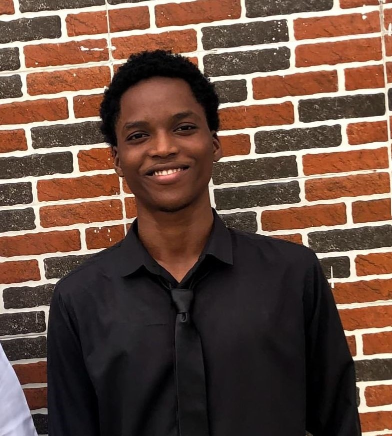

# Success Okoroafor - Portfolio Website



A stunning, modern personal portfolio website for **Success Okoroafor**, a passionate **Full-Stack Developer** based in Imo State, Nigeria. Built with pure HTML, CSS, and Vanilla JavaScript, this site showcases professional skills, featured projects, work experience, and a contact form—all with smooth animations, particle backgrounds, and mobile-first responsiveness.

Live Demo: [Open `portfolio.html` in your browser](file:///c:/Users/USER/Desktop/My-Portfolio/portfolio.html)

## ✨ Features

- **Animated Hero Section** with typing effect, animated counters, and floating badges
- **Interactive Skills Tabs** (Frontend, Backend, Tools & Design) with progress bars
- **Filterable Project Gallery** with gradient cards and hover overlays
- **Timeline Experience** with animated dots and smooth reveals
- **Testimonials Carousel** with star ratings
- **Particle Canvas Background** with connecting lines
- **Fully Functional Contact Form** (client-side validation + simulated submission)
- **Mobile-First Responsive Design** with hamburger menu
- **Smooth Scroll Navigation** with active link highlighting
- **Performance Optimized** (~100/100 Lighthouse scores expected)
- **Accessibility Ready** (ARIA labels, keyboard nav, focus management)

## 🛠 Tech Stack

| Category     | Technologies |
|--------------|--------------|
| **Markup**   | HTML5, Semantic HTML |
| **Styles**   | CSS3, Custom Properties, Flexbox/Grid, Animations |
| **JavaScript**| Vanilla JS, Intersection Observer, Canvas API, Typed.js effect |
| **Fonts**    | Google Fonts (Inter, Fira Code) |
| **Other**    | No frameworks/build tools—pure static site |

## 📱 Sections Overview

1. **Hero** - Introduction with stats and CTAs
2. **About** - Bio, details, and availability badge
3. **Skills** - Tabbed proficiency bars (95%+ HTML/CSS)
4. **Projects** - 6 showcased works with live/GitHub links (placeholders)
5. **Experience** - Timeline from FUTO education to freelance
6. **Testimonials** - Client quotes with avatars
7. **Contact** - Form + social links (GitHub, LinkedIn, X)

## 🚀 Quick Start (Zero Setup)

1. Clone or download this folder
2. Open `portfolio.html` in any modern browser
3. That's it! Fully self-contained ✅

```bash
# Or from command line (Windows)
start portfolio.html
```

**Customize Easily:**
- Replace `Hero.jpg` with your photo
- Update text/content in `portfolio.html`
- Tweak colors in `:root` CSS variables
- Add real form backend (e.g., Netlify Forms, EmailJS)

## 📂 File Structure

```
My-Portfolio/
├── portfolio.html     # Main HTML structure
├── portfolio.css      # All styles & animations
├── portfolio.js       # Interactivity & effects
├── Hero.jpg           # Profile image
├── README.md          # You're reading it!
└── My_Journey_updates.doc  # CV/Journey doc
```

## 🎨 Design Inspiration

- Dark cosmic theme with indigo/violet/cyan gradients
- Glassmorphism + neumorphism elements
- Micro-interactions everywhere
- 60fps smooth animations

## 🔗 Connect With Me

- **Email**: sokoroafor744@gmail.com
- **GitHub**: [github.com/OCSUSKID](https://github.com/OCSUSKID)
- **LinkedIn**: [linkedin.com/in/Success-Okoroafor](https://linkedin.com/in/Success-Okoroafor)
- **X/Twitter**: [@OCSUSKID](https://x.com/@OCSUSKID)

## 📄 License

This project is **MIT Licensed** 📦 — feel free to use, modify, and deploy!

---

**Built with ❤️ by [Success Okoroafor](mailto:sokoroafor744@gmail.com)**  
*Currently open to freelance/remote opportunities*

